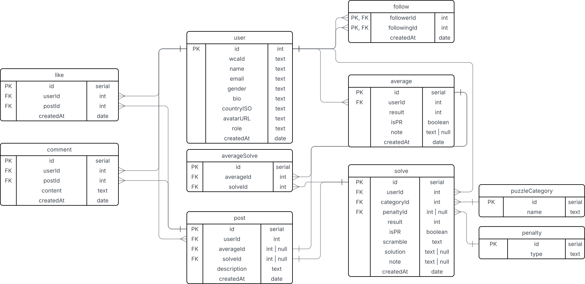

# DataBase, Tables, etc.

Porbably needed Tables and their attributes:

- User

  - id
  - wcaId
  - name
  - email
  - avatarUrl
  - role
  - createdAt

- Follow

  - followerId
  - followingId
  - createdAt

- PuzzleCategory

  - id
  - name

- Solve

  - id
  - userId
  - categoryId
  - penaltyId
  - result (not calling this time, allows more flexibility for e.g. fmc)
  - scramble
  - solution
  - note
  - createdAt

- Average

  - id
  - userId
  - result
  - note
  - createdAt

- Average Solve

  - id
  - averageId
  - solveId

- Penalty

  - id
  - type

- Post

  - id
  - userId
  - solveId
  - averageId
  - description
  - createdAt

- Like

  - id
  - userId
  - postId
  - createdAt

- Comment

  - id
  - userId
  - postId
  - content
  - createdAt

ER Diagram of database: See below or [in Lucid project](https://lucid.app/lucidchart/ab6226c4-6f45-43fa-b24a-b640c2b84a78/edit?viewport_loc=-92%2C-158%2C2380%2C1295%2C0_0&invitationId=inv_375ddb79-843f-4e56-aa14-135a594d897a)

